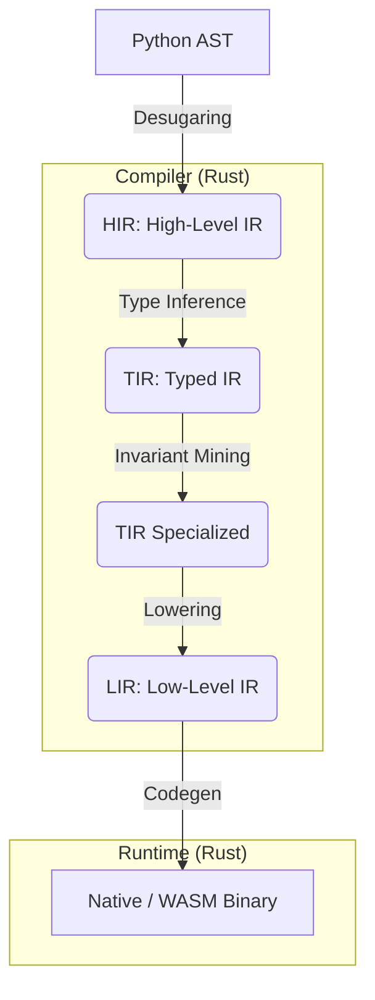

# Molt Developer Guide

Welcome to the Molt codebase. This guide is designed to help you understand the architecture, navigation, and philosophy of the project.

## What is Molt?

Molt is a research-grade project to compile a **verified per-application subset of Python** into **small, fast native binaries**. It is not just a compiler; it is a systems engineering platform that treats Python as a specification for high-performance native code.

Key Differentiators:
- **Verified Subset**: We don't support *everything* (see `docs/spec/0800_WHAT_MOLT_IS_WILLING_TO_BREAK.md`).
- **Determinism**: Binaries are 100% deterministic.
- **AI-Augmented**: We use AI as a development-time accelerator (see below).

## Key Concepts

Molt uses specific terminology that might be new to Python developers.
- **Glossary**: See `docs/GLOSSARY.md` for definitions of terms like "Tier 0", "NaN-boxing", and "Monomorphization".
- **Security & Capabilities**: See `docs/CAPABILITIES.md` for how Molt gates access to I/O and network operations.
- **Security Hardening**: See `docs/SECURITY.md` for threat models and safety invariants.
- **Performance & Benchmarking**: See `docs/BENCHMARKING.md` for how to measure and validate optimizations.

## Architecture Overview

Molt operates as a hybrid stack:



1.  **Frontend (Python/Rust)**: Parses Python and lowers it to an Intermediate Representation (IR).
2.  **Compiler (Rust)**: Optimizes the IR and generates machine code (AOT) using Cranelift.
3.  **Runtime (Rust)**: Provides the execution environment, object model (NaN-boxed), and garbage collection.

### Recommended Spec Reading Order

The `docs/spec/` directory contains the detailed engineering specifications. We recommend reading them in this order:

1.  **`0002-architecture.md`**: The high-level view of the pipeline and IR stack.
2.  **`0003-runtime.md`**: Details on the object model and memory management.
3.  **`0014_TYPE_COVERAGE_MATRIX.md`**: What types are currently supported.
4.  **`STATUS.md`**: The current canonical status of the project.

### Directory Structure

- **`compiler/`**: The heart of the compilation pipeline.
    - `molt/`: Main compiler crate.
- **`runtime/`**: The runtime support system.
    - `molt-runtime/`: Core runtime (scheduler, intrinsics).
    - `molt-obj-model/`: The NaN-boxed object model and type system.
    - `molt-db/`: Database connectors and pools.
    - `molt-worker/`: The execution harness for compiled binaries/workers.
- **`src/`**: Python source code.
    - `molt/`: The CLI entry point, standard library shims, and frontend logic.
    - `molt_accel/`: Accelerator scaffolding.
- **`tools/`**: Development and build scripts (`dev.py`, `bench.py`).
- **`tests/`**: Test suites (differential testing vs CPython).
- **`docs/`**: Project documentation and specifications (`spec/`).

## AI Strategy (Development-Time Only)

Molt leverages Artificial Intelligence as a **development-time accelerator** and **optimization strategist**. Crucially, the final compiled binaries are 100% deterministic machine code with **zero runtime AI dependency**.

### How we use AI:
1.  **Invariant Mining**: AI analyzes execution traces to find "stable class layouts" and "monomorphic call sites" that static analysis might miss.
2.  **Guard Synthesis**: AI helps synthesize optimal runtime checks (guards) for dynamic types based on observed frequency.
3.  **Automated Test Generation**: LLMs explore edge cases in Python semantics to improve our differential testing suite (`molt-diff`).

**Security Guarantee**: There is no "probabilistic execution". All AI-suggested optimizations are validated by the compiler's **Soundness Model** before being committed to native code.

## Getting Started for Developers

If you want to modify Molt, follow these steps:

1.  **Setup**: Ensure you have Rust (stable) and Python 3.12+ installed.
2.  **Build**:
    ```bash
    cargo build --package molt-runtime
    ```
3.  **Test**:
    ```bash
    # Run the full dev suite
    tools/dev.py test
    ```
4.  **Explore**:
    - Start with `README.md` for CLI usage.
    - Read `docs/spec/STATUS.md` for current feature parity.
    - Check `ROADMAP.md` for where we are going.

## Contributing

Ready to contribute code? Please read `docs/CONTRIBUTING.md`. Note that Molt has high standards for "long-running work" and "rigorous verification".

## Resources

- **Specifications**: `docs/spec/` contains detailed architectural decisions (ADRs).
- **Benchmarks**: `tools/bench.py` and `README.md` (Performance section).
