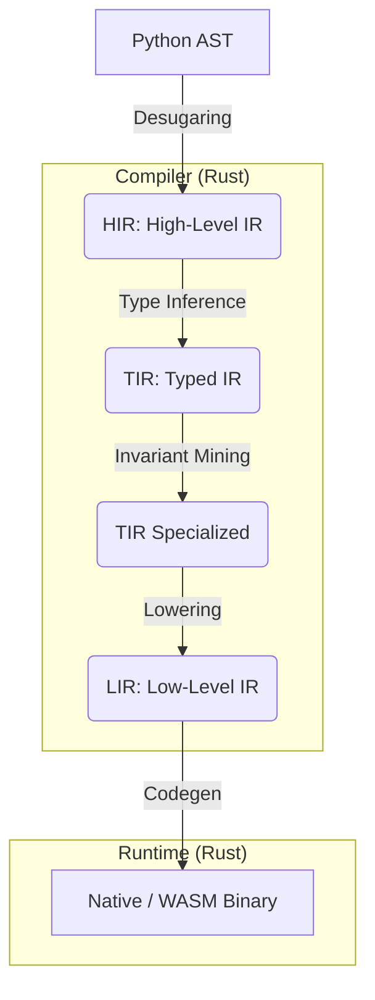

# Molt Developer Guide

Welcome to the Molt codebase. This guide is designed to help you understand the architecture, navigation, and philosophy of the project.

## What is Molt?

Molt is a research-grade project to compile a **verified per-application subset of Python** into **small, fast native binaries**. It is not just a compiler; it is a systems engineering platform that treats Python as a specification for high-performance native code.

Key Differentiators:
- **Verified Subset**: We don't support *everything* (see `docs/spec/areas/core/0800_WHAT_MOLT_IS_WILLING_TO_BREAK.md`).
- **Determinism**: Binaries are 100% deterministic.

## Project Vision and Scope
For the canonical vision and scope, read `docs/spec/areas/core/0000-vision.md` and
`docs/spec/areas/core/0800_WHAT_MOLT_IS_WILLING_TO_BREAK.md`. At a high level:

- **What Molt is**: a compiler + runtime for a verified, per-application subset
  of Python with explicit contracts and reproducible outputs.
- **What Molt is not**: a drop-in, full CPython replacement; a runtime with
  hidden nondeterminism; a system that silently accepts unsupported semantics.
- **What Molt will break**: dynamic behaviors that prevent static guarantees
  (monkeypatching, uncontrolled `eval/exec`, unrestricted reflection) unless
  explicitly guarded and documented in the specs.

## Key Concepts

Molt uses specific terminology that might be new to Python developers.
- **Glossary**: See `docs/GLOSSARY.md` for definitions of terms like "Tier 0", "NaN-boxing", and "Monomorphization".
- **Security & Capabilities**: See `docs/CAPABILITIES.md` for how Molt gates access to I/O and network operations.
- **Security Hardening**: See `docs/SECURITY.md` for threat models and safety invariants.
- **Performance & Benchmarking**: See `docs/BENCHMARKING.md` for how to measure and validate optimizations.

## Architecture Overview

Molt operates as a hybrid stack:



1.  **Frontend (Python/Rust)**: Parses Python and lowers it to an Intermediate Representation (IR).
2.  **Compiler (Rust)**: Optimizes the IR and generates machine code (AOT) using Cranelift.
3.  **Runtime (Rust)**: Provides the execution environment, object model (NaN-boxed), and garbage collection.

### Layer Map (Lowest -> Highest)
Use this map when deciding where a change belongs and what else it touches.

1. **Runtime primitives (Rust)**: memory layout, NaN-boxing, RC/GC, core intrinsics.
   - Paths: `runtime/molt-obj-model/src/`, `runtime/molt-runtime/src/`
   - Specs: `docs/spec/areas/runtime/0003-runtime.md`, `docs/spec/areas/core/0004-tiers.md`
   - Examples: `runtime/molt-obj-model/src/lib.rs`, `runtime/molt-runtime/src/arena.rs`
2. **Runtime services (Rust)**: scheduler, tasks/channels, IO, capability gates.
   - Paths: `runtime/molt-runtime/src/`, `runtime/molt-backend/src/`
   - Specs: `docs/spec/areas/runtime/0505_IO_ASYNC_AND_CONNECTORS.md`, `docs/spec/areas/wasm/0400_WASM_PORTABLE_ABI.md`
   - Examples: `runtime/molt-backend/src/wasm.rs`, `runtime/molt-backend/src/main.rs`
3. **Compiler core (Rust)**: IR definitions, lowering rules, optimizations, codegen.
   - Paths: `compiler/molt/frontend/`, `compiler/molt/codegen/`
   - Specs: `docs/spec/areas/core/0002-architecture.md`, `docs/spec/areas/compiler/0019_BYTECODE_LOWERING_MATRIX.md`
   - Examples: `compiler/molt/frontend/`, `compiler/molt/codegen/`
4. **Frontend + CLI (Python)**: parsing, CLI UX, packaging, stdlib shims.
   - Paths: `src/molt/`, `src/molt/cli.py`, `src/molt/stdlib/`
   - Specs: `docs/spec/areas/compat/0015_STDLIB_COMPATIBILITY_MATRIX.md`
   - Examples: `src/molt/cli.py`, `src/molt/type_facts.py`, `src/molt/stdlib/`
5. **Tooling + Tests**: dev scripts, benchmarks, differential tests, fixtures.
   - Paths: `tools/`, `tests/`, `bench/`, `examples/`
   - Examples: `tools/dev.py`, `tools/bench.py`, `tools/bench_wasm.py`, `tools/wasm_link.py`, `tools/wasm_profile.py`, `tests/differential/`, `tests/test_wasm_*.py`
6. **Specs + Roadmap**: contracts, parity status, scope limits, future work.
   - Paths: `docs/spec/`, `docs/spec/STATUS.md`, `docs/ROADMAP.md`
   - Examples: `docs/spec/areas/core/0000-vision.md`, `docs/spec/areas/compat/0014_TYPE_COVERAGE_MATRIX.md`

### Recommended Spec Reading Order

The `docs/spec/areas/` directory contains the detailed engineering specifications.
We recommend reading them in this order:

1.  **`docs/spec/areas/core/0002-architecture.md`**: The high-level view of the pipeline and IR stack.
2.  **`docs/spec/areas/runtime/0003-runtime.md`**: Details on the object model and memory management.
3.  **`docs/spec/areas/compat/0014_TYPE_COVERAGE_MATRIX.md`**: What types are currently supported.
4.  **`docs/spec/STATUS.md`**: The current canonical status of the project.

### Directory Structure

- **`compiler/`**: The heart of the compilation pipeline.
    - `molt/`: Compiler crate root.
    - `molt/frontend/`: Frontend and IR construction.
    - `molt/codegen/`: Lowering and code generation.
- **`runtime/`**: The runtime support system.
    - `molt-runtime/`: Core runtime (scheduler, intrinsics).
    - `molt-obj-model/`: The NaN-boxed object model and type system.
    - `molt-db/`: Database connectors and pools.
    - `molt-worker/`: The execution harness for compiled binaries/workers.
- **`src/`**: Python source code.
    - `molt/`: The CLI entry point, standard library shims, and frontend logic.
    - `molt_accel/`: Accelerator scaffolding.
- **`tools/`**: Development and build scripts (`dev.py`, `bench.py`).
- **`tests/`**: Test suites (differential testing vs CPython).
- **`docs/`**: Project documentation and specifications (`spec/`).

## When Adding New Functionality
Use this checklist to ensure you touch the right layers and docs.

1. **Decide the layer of truth**:
   - Runtime semantics belong in `runtime/`.
   - Lowering or IR changes belong in `compiler/`.
   - CLI/user-facing behavior belongs in `src/molt/`.
2. **Find the spec anchor**:
   - Add or update a spec in `docs/spec/`.
   - Sync capability/limits in `docs/spec/STATUS.md`.
   - Update `docs/ROADMAP.md` for scope or milestones.
3. **Wire through the stack**:
   - If new IR or opcode: update lowering rules + runtime hooks.
   - If new runtime behavior: update tests and the parity matrix if needed.
   - If new capability: document gating in specs and ensure tests cover it.
4. **Add tests at the right level**:
   - Unit (Rust) for runtime/IR.
   - Differential (Python) for semantic parity.
   - WASM parity when behavior crosses targets.
5. **Document the integration points**:
   - Add notes to `docs/DEVELOPER_GUIDE.md` if a new module changes the map.
   - Update `README.md` only when user-facing behavior changes.

## Getting Started for Developers

If you want to modify Molt, follow these steps:

1.  **Setup**: Ensure you have Rust (stable) and Python 3.12+ installed.
2.  **Build**:
    ```bash
    cargo build --package molt-runtime
    ```
3.  **Test**:
    ```bash
    # Run the full dev suite
    tools/dev.py test
    ```
    ```bash
    # Run CPython regrtest against Molt (logs under logs/cpython_regrtest/)
    python3 tools/cpython_regrtest.py --clone
    ```
    ```bash
    # Run with uv-managed Python 3.12 and coverage enabled
    python3 tools/cpython_regrtest.py --uv --uv-python 3.12 --uv-prepare --coverage
    ```
    ```bash
    # Include Rust coverage (requires cargo-llvm-cov)
    python3 tools/cpython_regrtest.py --uv --uv-python 3.12 --uv-prepare --rust-coverage
    ```
    ```bash
    # Multi-version run (3.12 + 3.13) with a skip list
    python3 tools/cpython_regrtest.py --uv --uv-python 3.12 --uv-python 3.13 \
        --uv-prepare --skip-file tools/cpython_regrtest_skip.txt
    ```
    ```bash
    # Core-only smoke run (curated test list)
    python3 tools/cpython_regrtest.py --core-only --core-file tools/cpython_regrtest_core.txt
    ```
    The regrtest harness writes logs to `logs/cpython_regrtest/` with a
    per-version `summary.md` plus a root `summary.md`. Each run also includes
    `diff_summary.md`, `type_semantics_matrix.md`, and (when enabled)
    Rust coverage output under `rust_coverage/` to align parity work with the
    stdlib and type/semantics matrices. `--coverage` combines host regrtest
    coverage with Molt subprocess coverage (use a Python-based `--molt-cmd` to
    capture it). Use `--no-diff` for regrtest-only runs, and use
    `--clone`/`--uv-prepare` explicitly when you want networked downloads.
    Multi-version runs clone versioned checkouts under
    `third_party/cpython-<ver>/`. The shim treats `MOLT_COMPAT_ERROR` results as
    skipped and records the reason in `junit.xml`. Regrtest runs set
    `MOLT_MODULE_ROOTS` and `MOLT_REGRTEST_CPYTHON_DIR` so CPython `Lib/test`
    sources are compiled without polluting host `PYTHONPATH`.
4.  **Explore**:
    - Start with `README.md` for CLI usage.
    - Read `docs/spec/STATUS.md` for current feature parity.
    - Check `ROADMAP.md` for where we are going.

If you have a packaged install (Homebrew/Scoop/Winget), keep local dev
isolated by running the repo CLI directly:

```bash
MOLT_HOME=~/.molt-dev PYTHONPATH=src uv run --python 3.12 python3 -m molt.cli build examples/hello.py
```

## WASM Workflow

- Build (linked): `PYTHONPATH=src python3 -m molt.cli build --target wasm --linked examples/hello.py`
- Build (custom linked output): `PYTHONPATH=src python3 -m molt.cli build --target wasm --linked --linked-output dist/app_linked.wasm examples/hello.py`
- Build (require linked): `PYTHONPATH=src python3 -m molt.cli build --target wasm --require-linked examples/hello.py`
- Run (Node/WASI): `node run_wasm.js /path/to/output.wasm` (prefers `*_linked.wasm` when present; disable with `MOLT_WASM_PREFER_LINKED=0`)

## Operational Assumptions

Molt work is designed around long-running, resumable sessions:

- Run multi-stage tasks in tmux and assume you will detach/reconnect.
- Write logs and artifacts to disk so progress survives disconnects.
- Include resume commands in progress reports and status updates.
- Avoid one-shot assumptions or ephemeral terminals.

See `docs/OPERATIONS.md` for the full operational workflow and logging rules.

## Contributing

Ready to contribute code? Please read `CONTRIBUTING.md`. Note that Molt has high standards for "long-running work" and "rigorous verification".

## Resources

- **Specifications**: `docs/spec/` contains detailed architectural decisions (ADRs).
- **Benchmarks**: `tools/bench.py` and `README.md` (Performance section).
