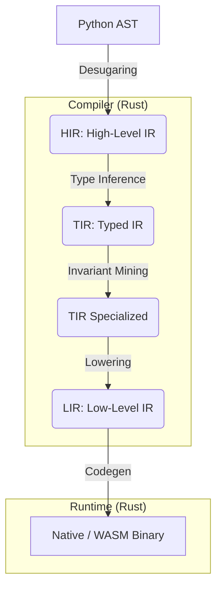

# Molt Developer Guide

Welcome to the Molt codebase. This guide is designed to help you understand the architecture, navigation, and philosophy of the project.

## What is Molt?

Molt is a research-grade project to compile a **verified per-application subset of Python** into **small, fast native binaries**. It is not just a compiler; it is a systems engineering platform that treats Python as a specification for high-performance native code.

Key Differentiators:
- **Verified Subset**: We don't support *everything* (see [spec/areas/core/0800_WHAT_MOLT_IS_WILLING_TO_BREAK.md](spec/areas/core/0800_WHAT_MOLT_IS_WILLING_TO_BREAK.md)).
- **Determinism**: Binaries are 100% deterministic.

## Project Vision and Scope
For the canonical vision and scope, read [spec/areas/core/0000-vision.md](spec/areas/core/0000-vision.md) and
[spec/areas/core/0800_WHAT_MOLT_IS_WILLING_TO_BREAK.md](spec/areas/core/0800_WHAT_MOLT_IS_WILLING_TO_BREAK.md). At a high level:

- **What Molt is**: a compiler + runtime for a verified, per-application subset
  of Python with explicit contracts and reproducible outputs.
- **What Molt is not**: a drop-in, full CPython replacement; a runtime with
  hidden nondeterminism; a system that silently accepts unsupported semantics.
- **What Molt will break**: dynamic behaviors that prevent static guarantees
  (monkeypatching, uncontrolled `eval/exec`, unrestricted reflection) unless
  explicitly guarded and documented in the specs.

## Version Policy
- Molt targets **Python 3.12+** semantics only.
- Do not add compatibility for <=3.11.
- When 3.12/3.13/3.14 diverge, document the target in specs/tests.

## Work Granularity

Molt engineering work starts from one tiny, named aperture: one invariant,
command family, file cluster, authority surface, or failing execution path. The
aperture keeps discovery bounded; it is not the deliverable. Once the aperture
exposes the real structure, rip through the full bug class or
duplicated-authority cluster: all sibling classifiers, call sites, generated
facts, backend/frontend/tooling consumers, docs, and proof lanes that govern the
same semantic fact. Avoiding the larger abstraction by landing one match arm,
one file-local patch, one test case, or one easy audit decrement leaves the
system worse.

Carve work smaller only along real subsystem boundaries. A valid cut removes all
parallel sources of truth inside that subsystem and leaves a stronger
end-state-compatible foundation for the next subsystem. If a proposed cut leaves
the same class of duplicate authority beside it, widen the cut before writing
code.

Convenient tiny-chip progress is an anti-pattern. It feels safe because each
step is easy to prove, but it silently preserves the wrong architecture. If an
operator or reviewer says the work is being sliced too small, treat that as a
binding correction: stop defending the local plan, widen the design radius, and
close the coherent structural class.

### Tiny Aperture, Full Rip

"Tiny slice and rip it open" is binding operator policy. The slice is the entry
aperture, not the deliverable or work-size limit. Pick one concrete invariant,
command family, file cluster, authority surface, or failing execution path that
exposes the real structure, then follow it through every sibling consumer needed
to delete or unify the duplicate lane.

This is the stable way to work after Codex/Desktop/process instability: one
active structural arc, one bounded proof lane, no retry storms, and no parallel
proof fanout. Subagents may map or migrate disjoint consumers inside that arc, but
they must not multiply status chatter or broaden cleanup scope.

### Crash Recovery Structural Stability Mode

If Codex, Claude, Desktop, WSL bridging, MCP/tool discovery, subagents, process
custody, or a guarded command has crashed, stalled, disappeared, or been
manually killed in the current session, stabilize the control plane without
shrinking the engineering unit into tiny chips. Reduce concurrency, isolate
Molt-owned process scope, record evidence paths, and keep the landing a
complete structural primitive that deletes or unifies a real authority.

Before risky commands in this mode, leave a death capsule: command, cwd, guard
pid, expected child pid when known, status, timestamp, and evidence path. Use
`tmp/memory_guard/active/`, `tmp/memory_guard/incidents/`, pytest outer-guard
summaries, and `logs/agents/codex_stall/*.json` before relying on chat history.
Manual killing of a Molt-owned child/helper must be recorded as child failure or
interruption; cleanup must not expand to Codex, Claude, app-server, renderer,
node-repl, ancestors, or unrelated host control-plane processes.
Only live-proved Molt-owned processes may be cleaned: build, test, bench,
backend-daemon, runtime-child, or guard-owned process groups whose current
command, sidecar, session, or lineage identity proves this repo's Molt custody.
Repo path, process name, stale PID, or a Codex/Claude parent is not cleanup
authority.

## Verification Budget

Verification exists to prove the structural invariant being moved. During
implementation, use one bounded static or targeted check that can catch
integration mistakes in the owned arc, then return to code. Do not spin broad
conformance, regrtest, benchmark, or validation lanes unless you are making the
corresponding compatibility/performance/release claim or a maintainer asks for
that proof.

If a targeted proof fails, fix the structural cause and rerun that specific
proof once. Expand the proof radius only when the failure reveals a genuine
cross-layer contract risk. Repeated lint/test loops are a velocity failure when
the architecture is still mid-move.

`tools/structural_audit.py --check` is the automated god-file,
structural-god-file, and duplicate-authority ratchet, and `tools/ci_gate.py
--tier 1` runs it by default. Use it to keep structural growth honest: split new
authority into coherent modules/packages, keep multiple large extraction regions
out of one file, do not grow monoliths for convenience, and do not repin
`tools/structural_audit_baseline.json` without explicit maintainer acceptance
and a retirement plan.

## Cross-Platform Notes
- **macOS**: install Xcode CLT (`xcode-select --install`) and LLVM via Homebrew.
- **Linux**: install LLVM/Clang, CMake, and Ninja via your package manager.
- **Windows**: install Visual Studio Build Tools (MSVC), CMake, Ninja, and
  LLVM/Clang (see [spec/areas/tooling/0001-toolchains.md](spec/areas/tooling/0001-toolchains.md)).
  The LLVM backend requires a matching `llvm-config`, not just `clang`; use
  `python tools/bootstrap_llvm.py --version 22.1.8 --prefix target\toolchains\llvm-22.1.8`
  when package-manager LLVM omits it.
- **WASM**: linked builds require `wasm-ld` + `wasm-tools` across platforms; packaging/demo flows also use `wasm-pack`.

## Platform Pitfalls
- **macOS SDK versioning**: if linking fails, ensure Xcode CLT is installed and `xcrun --show-sdk-version` works; set `MACOSX_DEPLOYMENT_TARGET` when cross-linking.
- **arm64 Python 3.14**: uv-managed 3.14 can hang on macOS arm64; install a system `python3.14` and use `--no-managed-python` (see [spec/STATUS.md](spec/STATUS.md)).
- **Windows toolchain conflicts**: prefer a single active toolchain (MSVC or clang); ensure `clang`, `cmake`, and `ninja` are on PATH.
- **Windows path lengths**: keep repo paths short and avoid deeply nested build output paths when possible.
- **WASM linker availability**: `wasm-ld` and `wasm-tools` must be installed; use `--require-linked` to fail fast when they are missing.

## Toolchain And Dependency Maintenance

Use the CLI as the single source of truth for setup, diagnostics, validation,
and repo refreshes:

```bash
molt setup
molt doctor
molt validate --check --suite smoke
molt update --check
```

- `molt setup` is the canonical bootstrap/readiness command. It reports exact
  toolchain actions plus the canonical Molt env layout, including the exact
  `LLVM_SYS_<ver>_PREFIX` expected by the Rust LLVM binding.
- `tools/bootstrap_llvm.py` is the source-build escape hatch for platforms whose
  LLVM packages omit `llvm-config`. It builds into `target/toolchains/`, verifies
  `bin/llvm-config`, and prints the exact `LLVM_SYS_<ver>_PREFIX` assignment.
- `molt doctor` reports missing tools and version-pinned backend prerequisites such as the LLVM lane required by `runtime/molt-backend/Cargo.toml`.
- `molt validate --check --suite smoke` prints the canonical local validation
  matrix without executing it.
- `molt update --check` prints the exact commands Molt will run, without mutating the checkout or the machine.

For a normal repo refresh:

```bash
molt update
```

This updates the Rust stable toolchain, ensures the wasm Rust targets exist,
installs missing cargo-hosted helper tools such as `wasm-tools`/`wasm-pack`,
and refreshes the repo lockfiles.

Python dependency resolution is uv-owned and future-forward. The project floor
is CPython `>=3.12` with no artificial upper cap; run floor checks with
`uv run --python 3.12 ...`, then add newer CPython lanes as they become
available and relevant to the touched compatibility surface.

For a deliberate maintainer sweep that also upgrades direct Rust dependency requirements in manifests:

```bash
molt update --all
```

Treat `--all` as a coordinated change: rebuild the touched crates and rerun the backend/runtime verification matrix in the same session.

Node package surfaces are package-manager pinned. Use Corepack so the
`packageManager` field in each `package.json` selects the lockfile writer and
audit engine, rather than whatever stale global `npm` happens to be on PATH:

Molt's JavaScript tooling is future-forward with a hard floor, not an upper cap:
Node `>=24.18.0` (current Active LTS floor) and npm `>=11.17.0`. The preferred
maintainer lane tracks the current Node release line as it appears; on
2026-06-25 that is Node `26.4.0` with npm `11.17.0`. Keep package manifests'
`engines` and `packageManager` fields aligned with that policy.

```bash
corepack npm install --package-lock-only
corepack npm audit
```

The current Cloudflare package authorities are
`deploy/cloudflare/package.json` and
`examples/edgebox/packages/edgebox-cloudflare/package.json`; keep their v3
lockfiles committed with the manifest change.

## Differential Suite Controls
- **Memory profiling**: set `MOLT_DIFF_MEASURE_RSS=1` to collect per-test RSS metrics.
- **Summary sidecar**: `MOLT_DIFF_ROOT/summary.json` (or `MOLT_DIFF_SUMMARY=<path>`) records jobs, limits, and RSS aggregates.
- **Failure queue**: failed tests are written to `MOLT_DIFF_ROOT/failures.txt` (override with `MOLT_DIFF_FAILURES` or `--failures-output`).
- **OOM retry**: OOM failures retry once with `--jobs 1` by default (`MOLT_DIFF_RETRY_OOM=0` disables).
- **Memory caps**: default adaptive per-process, per-tree, and global RSS budgets
  with an adaptive child rlimit; override with `MOLT_DIFF_CHILD_RLIMIT_GB`,
  legacy `MOLT_DIFF_RLIMIT_GB`/`MOLT_DIFF_RLIMIT_MB`, or disable the child
  rlimit with `MOLT_DIFF_CHILD_RLIMIT_GB=0` only for an explicit local
  investigation.
- **Backend daemon mode**: set `MOLT_DIFF_BACKEND_DAEMON=1|0` to force daemon behavior in diff runs; default is platform-safe auto (`0` on macOS, `1` elsewhere).
- **dyld incident handling**: diff retries force `MOLT_BACKEND_DAEMON=0`; set `MOLT_DIFF_QUARANTINE_ON_DYLD=1` only if you explicitly want cold target/state quarantine.
- **no-cache safety lane**: set `MOLT_DIFF_FORCE_NO_CACHE=1|0` to force/disable `--no-cache`; default is cache-enabled on all platforms, and dyld guard/retry can force no-cache for the active incident-scoped run.
- **Shared diff Cargo target**: set `MOLT_DIFF_CARGO_TARGET_DIR` to reuse one shared Cargo artifact root across diff workers; `tools/throughput_env.sh --apply` sets this to `CARGO_TARGET_DIR` by default.
- **Diff run lock**: the harness now uses `<CARGO_TARGET_DIR>/.molt_state/diff_run.lock` to serialize overlapping full diff runs across agents. Tune waiting via `MOLT_DIFF_RUN_LOCK_WAIT_SEC` (default 900) and `MOLT_DIFF_RUN_LOCK_POLL_SEC`.

## Local Validation Entry Points

Use these as the canonical local gates:

```bash
molt validate --suite smoke
molt validate --suite custody-proof
molt validate
```

Interpretation:
- `molt validate --suite smoke` is the fast local presubmit matrix.
- `molt validate --suite custody-proof` runs the targeted custody lane for
  memory-guard, Windows process sampling, and repo process-sentinel wiring.
- `molt validate` is the heavier full local correctness + benchmark lane.
- Executed validation runs write a canonical JSON sidecar at
  `logs/validate-<suite>-<backend>-<profile>.json`; use `--summary-out` to
  choose an explicit artifact path.
- `molt validate --check --json` emits the exact planned commands, their
  memory-guard family prefixes, and the adaptive guard budgets that will apply
  to the run. Check-only mode does not write a sidecar unless `--summary-out`
  is provided. Use this payload only when you intentionally need broad proof;
  ordinary structural implementation should use a bounded targeted check.
- The smoke validation plan includes
  `tools/check_subprocess_guard_coverage.py` and
  `tools/check_memory_guard_wiring.py`, so raw subprocess launches and broader
  dev/test/bench entrypoint guard drift both fail in the canonical smoke lane.
- Use `molt validate --suite smoke --backend luau` for the first-class Luau lane;
  it checks generated support-matrix freshness, Luau backend/lowering Rust tests,
  checked Luau emission, Luau runner availability, and the targeted
  CPython-vs-Luau `ord_at` smoke under the shared memory guard.
- `tools/dev.py` remains available as a thin convenience delegate; it is not
  the behavioral authority.
- Every `tools/dev.py` command that launches through `uv run` first installs
  the canonical Molt artifact/cache/temp roots and a session id before entering
  the shared memory guard, while preserving explicit caller-provided root
  overrides for deliberate external artifact placement. When external artifacts
  are preferred and no explicit root is set, Windows hosts use local
  `%LOCALAPPDATA%\Molt` / temp-backed Molt roots before falling back to the
  repository, keeping volatile pytest/build temp directories off synced
  workspaces such as OneDrive.
- On Windows, the shared memory guard, pytest bootstrap handoff, and child
  runner all launch guarded subprocesses in an explicit new process group so
  timeout/RSS cleanup cannot deliver interrupt-style console control events into
  the parent guard or Codex/app control plane.
- Shared guarded subprocesses also run the default stale-orphan preflight before
  launch: orphaned live-proved Molt process groups older than one hour and orphaned
  pytest-style groups older than fifteen minutes are drained with process age,
  kill time, reason, pids, command, and next-action custody. Tune with
  `MOLT_STALE_ORPHAN_SEC`, `MOLT_STALE_PYTEST_SEC`, or disable deliberately with
  `MOLT_STALE_ORPHAN_CLEANUP=0`.
- Guarded command cleanup is child-session scoped. The workload is launched in
  its own child process group/session, and timeout/RSS cleanup records the child
  pid/pgid/sid, protected control-plane pgids, watched pids, SIGTERM/SIGKILL
  actions, RSS peaks/limits, cwd, command, sanitized env deltas, and repro
  payload. Harness profiles live under `logs/harness_memory_guard/commands.jsonl`
  by default; direct `tools/memory_guard.py` incidents without `--summary-json`
  write bounded summaries under `tmp/memory_guard/incidents/`.
  If identity is ambiguous, cleanup skips the process and preserves evidence;
  it must never terminate Codex, Claude, app-server, renderer, node-repl, shell,
  Git, MCP/plugin, ancestor, or other host-control-plane processes.
- `tools/dev.py bench` runs the pyproject-owned benchmark smoke lane by default
  and writes `bench/results/dev-bench-smoke.json`; pass explicit `molt bench`
  arguments when a custom native/WASM benchmark slice is needed. The outer
  command still uses the shared test-suite guard, while `molt bench` applies the
  benchmark-family memory guard to benchmark child processes.
- `tools/dev.py gates` executes the pyproject-owned CI-adjacent local gate
  sequence: backend and TIR Clippy with `-D warnings`, `cargo deny check`,
  release-fast workspace build, native backend lib tests, compliance tests, then
  an explicit working-tree status check. It writes
  `logs/dev-gates-summary.json` with the guard limits, commands, return codes,
  timings, git status, and any failure reason; use `--summary-out` for an
  explicit custody path. Use `--allow-dirty` only while preserving known partner
  WIP; commits should still be made from a reviewed staged set.
- `tools/dev.py lint` also runs the subprocess and memory-guard wiring audits
  from the pyproject command table, so command-runner drift is caught in the
  standard local lint lane rather than left to review memory.

## Canonical Debug Surface

Molt debugging now centers on the `molt debug` command family rather than on
ad hoc standalone scripts.

Wired today:

- `molt debug repro`
- `molt debug ir`
- `molt debug verify`
- `molt debug trace`
- `molt debug diff`
- `molt debug perf`
- `molt debug reduce`
- `molt debug bisect`

Under active build-out:

- runtime trace assertion widening beyond the currently wired call-bind families
  and the central `no pending exception on successful return` trap
- the canonical trace surface now also carries backend compile-time timing via
  the `backend_timing` family (`MOLT_BACKEND_TIMING=1`)
- the canonical trace surface now also carries per-function backend compile
  tracing via the `compile_func` family (`MOLT_TRACE_COMPILE_FUNC=1`)

Rules:

- `molt` is the public authority; legacy tools may remain only as additive
  wrappers during migration.
- Debug artifacts belong under canonical roots: `tmp/debug/` by default and
  `logs/debug/` for retained outputs.
- Every debug-facing feature must preserve explicit platform/version dimensions
  instead of inheriting host-specific behavior silently.
- Cross-platform support is the default requirement: when a host-specific
  capability is unavailable, return an explicit unsupported/error result rather
  than drifting.

## Fast Build Playbook

Use this workflow for high-velocity multi-agent iteration:

1. `tools/new-agent-task.sh <task-name>` for each long-lived agent lane.
2. `source logs/agents/<task-slug>/env.sh`
3. `tools/throughput_env.sh --apply`
4. `uv run --python 3.12 python3 -m molt.cli build --profile dev examples/hello.py --cache-report`
5. `UV_NO_SYNC=1 uv run --python 3.12 python3 -u tests/molt_diff.py --build-profile dev --jobs 2 <tests...>`

Key controls:
- `--profile dev` defaults to Cargo `dev-fast` (override via `MOLT_DEV_CARGO_PROFILE`).
- Native codegen uses a backend daemon (`MOLT_BACKEND_DAEMON=1`). If an
  attempted daemon compile fails, the CLI retries only classified lightweight
  probe/connect failures before a full IR compile request is admitted. Once a
  full request crosses the daemon socket, outcome ownership belongs to that
  daemon and the CLI fails closed instead of restarting or launching a hidden
  one-shot compile that duplicates backend memory.
- Cacheable daemon compiles use a probe-first request path: full IR is only encoded and sent after a daemon-declared cache miss.
- Native runtime verification/build starts asynchronously after cache/setup and is joined at the native link boundary; `emit=obj` intentionally skips that overlap because it never links a binary.
- Share `CARGO_TARGET_DIR` + `MOLT_CACHE` across agents when you want maximum reuse; lock/fingerprint state is under `<CARGO_TARGET_DIR>/.molt_state/` (or `MOLT_BUILD_STATE_DIR`), so explicit shared roots also share Cargo rebuild locks. Daemon sockets default to `MOLT_BACKEND_DAEMON_SOCKET_DIR` (local temp path).
- Agent task scaffolds record the exact sourced environment in
  `logs/agents/<task-slug>/env.sh`; source that file before build/test/bench
  commands so artifact roots, cache roots, daemon socket roots, and session
  identity stay reproducible across resumes.
- Keep `MOLT_DIFF_CARGO_TARGET_DIR=$CARGO_TARGET_DIR` for diff runs so Cargo artifacts are reused instead of split across ad-hoc roots.

Build-throughput roadmap lanes are tracked in [ROADMAP.md](../ROADMAP.md) under the tooling throughput section (daemon hardening, function-level cache, batch diff compile server, smarter diff scheduling, and distributed cache strategy).

## Key Concepts

Molt uses specific terminology that might be new to Python developers.
- **Glossary**: See [GLOSSARY.md](GLOSSARY.md) for definitions of terms like "Tier 0", "NaN-boxing", and "Monomorphization".
- **Security & Capabilities**: See [CAPABILITIES.md](CAPABILITIES.md) for how Molt gates access to I/O and network operations.
- **Security Hardening**: See [SECURITY.md](SECURITY.md) for threat models and safety invariants.
- **Performance & Benchmarking**: See [BENCHMARKING.md](BENCHMARKING.md) for how to measure and validate optimizations.

## Architecture Overview

Molt operates as a hybrid stack:


```mermaid
graph TD
    A[Python AST] -->|Desugaring| B(HIR: High-Level IR)
    B -->|Type Inference| C(TIR: Typed IR)
    C -->|Invariant Mining| D(TIR Specialized)
    D -->|Lowering| E(LIR: Low-Level IR)
    E -->|Codegen| F[Native / WASM Binary]

    subgraph "Compiler (Rust)"
    B
    C
    D
    E
    end

    subgraph "Runtime (Rust)"
    F
    end
```

1.  **Frontend (Python/Rust)**: Parses Python and lowers it to an Intermediate Representation (IR).
2.  **Compiler (Rust)**: Optimizes the IR and generates machine code (AOT) using Cranelift.
3.  **Runtime (Rust)**: Provides the execution environment, object model (NaN-boxed), and garbage collection.

### Layer Map (Lowest -> Highest)
Use this map when deciding where a change belongs and what else it touches.

1. **Runtime primitives (Rust)**: memory layout, NaN-boxing, RC/GC, core intrinsics.
   - Paths: `runtime/molt-obj-model/src/`, `runtime/molt-runtime/src/`
   - Specs: `docs/spec/areas/runtime/0003-runtime.md`, `docs/spec/areas/core/0004-tiers.md`
   - Examples: `runtime/molt-obj-model/src/lib.rs`, `runtime/molt-runtime/src/arena.rs`
2. **Runtime services (Rust)**: scheduler, tasks/channels, IO, capability gates.
   - Paths: `runtime/molt-runtime/src/`, `runtime/molt-backend/src/`
   - Specs: `docs/spec/areas/runtime/0505_IO_ASYNC_AND_CONNECTORS.md`, `docs/spec/areas/wasm/0400_WASM_PORTABLE_ABI.md`
   - Examples: `runtime/molt-backend/src/wasm.rs`, `runtime/molt-backend/src/main.rs`
3. **Compiler frontend + lowering (Python + Rust)**: IR construction, lowering rules, optimizations, and code generation.
   - Paths: `src/molt/frontend/`, `runtime/molt-backend/src/`
   - Specs: `docs/spec/areas/core/0002-architecture.md`, `docs/spec/areas/compiler/0019_BYTECODE_LOWERING_MATRIX.md`
   - Examples: `src/molt/frontend/__init__.py`, `runtime/molt-backend/src/wasm.rs`
4. **Frontend + CLI (Python)**: parsing, CLI UX, packaging, stdlib shims.
   - Paths: `src/molt/`, `src/molt/cli.py`, `src/molt/stdlib/`
   - Specs: `docs/spec/areas/compat/surfaces/stdlib/stdlib_surface_matrix.md`
   - Examples: `src/molt/cli.py`, `src/molt/type_facts.py`, `src/molt/stdlib/`
5. **Tooling + Tests**: dev scripts, benchmarks, differential tests, fixtures.
   - Paths: `tools/`, `tests/`, `bench/`, `examples/`
   - Examples: `tools/dev.py`, `tools/bench.py`, `tools/bench_wasm.py`, `tools/wasm_link.py`, `tools/wasm_profile.py`, `tests/differential/`, `tests/test_wasm_*.py`
6. **Specs + Roadmap**: contracts, parity status, scope limits, future work.
   - Paths: `docs/spec/`, `docs/spec/STATUS.md`, `ROADMAP.md`
   - Examples: `docs/spec/areas/core/0000-vision.md`, `docs/spec/areas/compat/surfaces/language/type_coverage_matrix.md`

### Rules Of Thumb For New Work
Use this decision order for both parity work and optimization work:

1. Add or extend a primitive when behavior is a reusable low-level hot semantic.
2. Expose that capability to stdlib through a Rust intrinsic.
3. Expose user-facing language/core behavior through builtins or stdlib APIs that call intrinsics/primitives (do not reimplement runtime semantics in Python shims).

### Recommended Spec Reading Order

The `docs/spec/areas/` directory contains the detailed engineering specifications.
We recommend reading them in this order:

1.  **`docs/spec/areas/core/0002-architecture.md`**: The high-level view of the pipeline and IR stack.
2.  **`docs/spec/areas/runtime/0003-runtime.md`**: Details on the object model and memory management.
3.  **`docs/spec/areas/compat/surfaces/language/type_coverage_matrix.md`**: What types are currently supported.
4.  **`docs/spec/STATUS.md`**: The current canonical status of the project.

### Directory Structure

- **`src/`**: Python frontend, CLI, stdlib shims, and compiler-side orchestration.
    - `molt/`: The CLI entry point, standard library shims, import/build plumbing, and frontend modules.
    - `molt/debug/`: Canonical debug/diff/perf/verify/reducer helper modules.
    - `molt/frontend/`: Python-side IR construction, analysis, and compiler orchestration.
- **`runtime/`**: The runtime support system.
    - `molt-runtime/`: Core runtime (scheduler, intrinsics).
    - `molt-obj-model/`: The NaN-boxed object model and type system.
    - `molt-backend/`: Native and WASM backend lowering/code generation.
    - `molt-db/`: Database connectors and pools.
    - `molt-worker/`: The execution harness for compiled binaries/workers.
- **`crates/`**: Rust helper crates that support tree shaking, lazy loading, and related compile-time packaging concerns.
- **`tools/`**: Development tooling and shared utility scripts (`dev.py`, `bench.py`, `tools/scripts/`).
  - legacy debug wrappers remain additive-only while the canonical `molt debug`
    surface absorbs their behavior.
- **`bench/`**: Benchmark harnesses, friend suites, benchmark-specific helper scripts, and benchmark result artifacts.
- **`demo/`**: Demo applications and vertical-slice integration examples.
- **`ops/`**: Operational support material and automation inputs.
- **`formal/` / `fuzz/`**: Formal methods and fuzzing assets.
- **`tests/`**: Test suites (differential testing vs CPython).
- **`docs/`**: Project documentation and specifications (`spec/`).
- **`wasm/`**: Checked-in WASM support assets, browser host files, and the Node/WASI runner `wasm/run_wasm.js`.

## When Adding New Functionality
Use this checklist to ensure you touch the right layers and docs.

1. **Decide the layer of truth**:
   - Runtime semantics belong in `runtime/`.
   - Lowering or IR changes belong in `src/molt/frontend/` or `runtime/molt-backend/`, depending on whether the change is Python-side pipeline logic or Rust backend codegen/runtime coupling.
   - CLI/user-facing behavior belongs in `src/molt/`.
2. **Find the spec anchor**:
   - Add or update a spec in `docs/spec/`.
   - Sync capability/limits in `docs/spec/STATUS.md`.
   - Update `ROADMAP.md` for scope or milestones.
3. **Wire through the stack**:
   - If new IR or opcode: update lowering rules + runtime hooks.
   - If new runtime behavior: update tests and the parity matrix if needed.
   - If new capability: document gating in specs and ensure tests cover it.
4. **Add tests at the right level**:
   - Unit (Rust) for runtime/IR.
   - Differential (Python) for semantic parity.
   - WASM parity when behavior crosses targets.
5. **Document the integration points**:
   - Add notes to `docs/DEVELOPER_GUIDE.md` if a new module changes the map.
   - Update `README.md` only when user-facing behavior changes.

## Coverage And Optimization Strategy
- Keep the architecture order intact while closing parity gaps: primitive -> intrinsic -> builtin/stdlib API.
- For remaining stdlib coverage, favor moving semantics into runtime intrinsics and keep Python wrappers to argument normalization, error mapping, and capability gating.
- For optimization, prioritize wins at primitive/intrinsic layers (fewer crossings, less dynamic dispatch, more deterministic behavior); avoid Python-shim micro-optimizations that duplicate runtime logic.
- Before release, merge, or broad support claims, run/verify the minimum gate
  matrix in `docs/spec/areas/testing/0008_MINIMUM_MUST_PASS_MATRIX.md`.
  Day-to-day structural work should use the bounded verification budget above.
- For release/publish policy checks, use `docs/spec/areas/tooling/0014_DETERMINISM_SECURITY_ENFORCEMENT_CHECKLIST.md`.

## Getting Started for Developers

If you want to modify Molt, follow these steps:

1.  **Setup**: Ensure you have Rust (stable) and Python 3.12+ installed.
2.  **Build**:
    ```bash
    cargo build --release --package molt-runtime
    ```
    For day-to-day compiler/runtime iteration, prefer the dev profile:
    ```bash
    uv run --python 3.12 python3 -m molt.cli build --profile dev examples/hello.py
    ```
    Use `--profile release` for production parity, benchmark baselines, and release artifacts.
3.  **Test**:
    ```bash
    # Run the full dev suite
    uv run --python 3.12 python3 tools/dev.py test
    ```
    ```bash
    # Run the full dev suite in seeded randomized order
    uv run --python 3.12 python3 tools/dev.py test --random-order --random-seed 17
    ```
    Randomized order is opt-in for developer DX only. The canonical full-suite
    proof lanes remain deterministic so failures stay reproducible.
    ```bash
    # Run CPython regrtest against Molt (logs under logs/cpython_regrtest/)
    uv run --python 3.12 python3 tools/cpython_regrtest.py --clone
    ```
    ```bash
    # Run with uv-managed Python 3.12 and coverage enabled
    uv run --python 3.12 python3 tools/cpython_regrtest.py --uv --uv-python 3.12 --uv-prepare --coverage
    ```
    ```bash
    # Include Rust coverage (requires cargo-llvm-cov)
    uv run --python 3.12 python3 tools/cpython_regrtest.py --uv --uv-python 3.12 --uv-prepare --rust-coverage
    ```
    ```bash
    # Multi-version run (3.12 + 3.13) with a skip list
    uv run --python 3.12 python3 tools/cpython_regrtest.py --uv --uv-python 3.12 --uv-python 3.13 \
        --uv-prepare --skip-file tools/cpython_regrtest_skip.txt
    ```
    ```bash
    # Core-only smoke run (curated test list)
    uv run --python 3.12 python3 tools/cpython_regrtest.py --core-only --core-file tools/cpython_regrtest_core.txt
    ```
    The regrtest harness writes logs to `logs/cpython_regrtest/` with a
    per-version `summary.md` plus a root `summary.md`. Each run also includes
    `diff_summary.md`, `type_semantics_matrix.md`, and (when enabled)
    Rust coverage output under `rust_coverage/` to align parity work with the
    stdlib and type/semantics matrices. `--coverage` combines host regrtest
    coverage with Molt subprocess coverage (use a Python-based `--molt-cmd` to
    capture it). Use `--no-diff` for regrtest-only runs, and use
    `--clone`/`--uv-prepare` explicitly when you want networked downloads.
    Multi-version runs clone versioned checkouts under
    `third_party/cpython-<ver>/`. The shim treats `MOLT_COMPAT_ERROR` results as
    skipped and records the reason in `junit.xml`. Regrtest runs set
    `MOLT_MODULE_ROOTS` and `MOLT_REGRTEST_CPYTHON_DIR` so CPython `Lib/test`
    sources are compiled without polluting host `PYTHONPATH`.
    In restricted/sandboxed environments (including Codex), `uv run` may panic
    when it tries to sync or resolve dependencies. Use `UV_NO_SYNC=1` to reuse
    the existing environment and avoid the sync path:
    ```bash
    UV_NO_SYNC=1 UV_CACHE_DIR=$PWD/.uv-cache uv run --python 3.12 python3 tools/dev.py test
    ```
    You can also enable randomized order through the runner environment:
    `MOLT_PYTEST_RANDOM_ORDER=1 MOLT_PYTEST_RANDOM_SEED=<seed>`.
    If you need to install or update deps, run `uv sync` locally outside the
    sandbox, then re-run commands with `UV_NO_SYNC=1`.
4.  **Explore**:
    - Start with `README.md` for the project overview and `docs/getting-started.md` for first-run CLI usage.
    - Read `docs/spec/STATUS.md` for current feature parity.
    - Check `ROADMAP.md` for where we are going.

If you have a packaged install (Homebrew/Scoop/Winget), keep local dev
isolated by running the repo CLI directly:

```bash
MOLT_HOME=~/.molt-dev uv run --python 3.12 python3 -m molt.cli build examples/hello.py
```

Build knobs (optional):
- `MOLT_BACKEND_PROFILE=release|dev` (backend compiler profile; default `release` for faster cross-target builds).
- `MOLT_CARGO_TIMEOUT`, `MOLT_BACKEND_TIMEOUT`, `MOLT_LINK_TIMEOUT` (timeouts in seconds for cargo, backend, and linker steps).

## Tooling Quickstart (Optional but Recommended)

### Pre-commit (Read-only checks)
```bash
uv run pre-commit install
uv run pre-commit run -a
```

Default pre-commit hooks are check-only. Use explicit commands such as
`uv run --python 3.12 ruff check --fix .`, `uv run --python 3.12 ruff format .`,
or `cargo fmt` before staging when a check reports required formatting changes.

### Differential coverage reporting
```bash
uv run --python 3.12 python3 tools/diff_coverage.py
# Writes tests/differential/COVERAGE_REPORT.md
```

### Type/stdlib TODO sync check
```bash
uv run --python 3.12 python3 tools/check_type_coverage_todos.py
```

### Runtime safety and fuzzing
```bash
uv run --python 3.12 python3 tools/runtime_safety.py clippy
uv run --python 3.12 python3 tools/runtime_safety.py miri
uv run --python 3.12 python3 tools/runtime_safety.py fuzz --target string_ops --runs 10000
```

### Supply-chain audits (optional gates)
```bash
cargo audit
cargo deny check
uv run pip-audit
corepack npm audit --prefix deploy/cloudflare
corepack npm audit --prefix examples/edgebox/packages/edgebox-cloudflare
```

### Faster Rust test runs
```bash
cargo nextest run -p molt-runtime --all-targets
```

### Build caching (Rust)
```bash
export RUSTC_WRAPPER=sccache
sccache -s
```

### Binary size + WASM size analysis
```bash
cargo bloat -p molt-runtime --release
cargo llvm-lines -p molt-runtime
twiggy top dist/output.wasm
wasm-opt -Oz -o dist/output.opt.wasm dist/output.wasm
wasm-tools strip dist/output.opt.wasm -o dist/output.stripped.wasm
```

### Native flamegraphs
```bash
cargo flamegraph -p molt-runtime --bench ptr_registry
```

## WASM Workflow

- Build (linked): `uv run --python 3.12 python3 -m molt.cli build --target wasm --linked examples/hello.py`
- Build (custom linked output): `uv run --python 3.12 python3 -m molt.cli build --target wasm --linked --linked-output dist/app_linked.wasm examples/hello.py`
- Build (require linked): `uv run --python 3.12 python3 -m molt.cli build --target wasm --require-linked examples/hello.py`
- Run (Node/WASI): `node wasm/run_wasm.js dist/output_linked.wasm` (requires linked output; build with `--linked` or `--require-linked`)

## Operational Assumptions

Molt work is designed around long-running, resumable sessions:

- Run multi-stage tasks in tmux and assume you will detach/reconnect.
- Write logs and artifacts to disk so progress survives disconnects.
- Include resume commands in progress reports and status updates.
- Avoid one-shot assumptions or ephemeral terminals.

See [OPERATIONS.md](OPERATIONS.md) for the full operational workflow and logging rules.

## Contributing

Ready to contribute code? Please read [CONTRIBUTING.md](../CONTRIBUTING.md). Note that Molt has high standards for "long-running work" and "rigorous verification".

## Resources

- **Specifications**: `docs/spec/` contains detailed architectural decisions (ADRs).
- **Benchmarks**: `tools/bench.py`, `docs/BENCHMARKING.md`, and `docs/spec/STATUS.md` (generated summary block).
