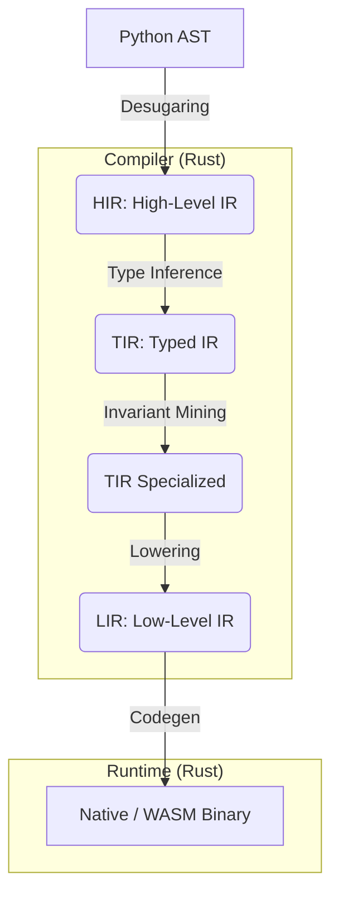

# Molt Developer Guide

Welcome to the Molt codebase. This guide is designed to help you understand the architecture, navigation, and philosophy of the project.

## What is Molt?

Molt is a research-grade project to compile a **verified per-application subset of Python** into **small, fast native binaries**. It is not just a compiler; it is a systems engineering platform that treats Python as a specification for high-performance native code.

Key Differentiators:
- **Verified Subset**: We don't support *everything* (see [docs/spec/areas/core/0800_WHAT_MOLT_IS_WILLING_TO_BREAK.md](docs/spec/areas/core/0800_WHAT_MOLT_IS_WILLING_TO_BREAK.md)).
- **Determinism**: Binaries are 100% deterministic.

## Project Vision and Scope
For the canonical vision and scope, read [docs/spec/areas/core/0000-vision.md](docs/spec/areas/core/0000-vision.md) and
[docs/spec/areas/core/0800_WHAT_MOLT_IS_WILLING_TO_BREAK.md](docs/spec/areas/core/0800_WHAT_MOLT_IS_WILLING_TO_BREAK.md). At a high level:

- **What Molt is**: a compiler + runtime for a verified, per-application subset
  of Python with explicit contracts and reproducible outputs.
- **What Molt is not**: a drop-in, full CPython replacement; a runtime with
  hidden nondeterminism; a system that silently accepts unsupported semantics.
- **What Molt will break**: dynamic behaviors that prevent static guarantees
  (monkeypatching, uncontrolled `eval/exec`, unrestricted reflection) unless
  explicitly guarded and documented in the specs.

## Version Policy
- Molt targets **Python 3.12+** semantics only.
- Do not add compatibility for <=3.11.
- When 3.12/3.13/3.14 diverge, document the target in specs/tests.

## Cross-Platform Notes
- **macOS**: install Xcode CLT (`xcode-select --install`) and LLVM via Homebrew.
- **Linux**: install LLVM/Clang, CMake, and Ninja via your package manager.
- **Windows**: install Visual Studio Build Tools (MSVC) plus LLVM/Clang, CMake, and Ninja (see [docs/spec/areas/tooling/0001-toolchains.md](docs/spec/areas/tooling/0001-toolchains.md)).
- **WASM**: linked builds require `wasm-ld` + `wasm-tools` across platforms.

## Platform Pitfalls
- **macOS SDK versioning**: ensure Xcode CLT is installed. Native builds default to a stable minimum deployment target (`11.0` on Apple Silicon, `10.13` on x86_64) instead of the active SDK version; set `MACOSX_DEPLOYMENT_TARGET` when you intentionally need a different minimum for cross-linking or newer APIs.
- **arm64 Python 3.14**: uv-managed 3.14 can hang on macOS arm64; install a system `python3.14` and use `--no-managed-python` (see [docs/spec/STATUS.md](docs/spec/STATUS.md)).
- **Windows toolchain conflicts**: prefer a single active toolchain (MSVC or clang); ensure `clang`, `cmake`, and `ninja` are on PATH.
- **Windows path lengths**: keep repo paths short and avoid deeply nested build output paths when possible.
- **WASM linker availability**: `wasm-ld` and `wasm-tools` must be installed; use `--require-linked` to fail fast when they are missing.

## Differential Suite Controls
- **Memory profiling**: set `MOLT_DIFF_MEASURE_RSS=1` to collect per-test RSS metrics.
- **Summary sidecar**: `MOLT_DIFF_ROOT/summary.json` (or `MOLT_DIFF_SUMMARY=<path>`) records jobs, limits, and RSS aggregates.
- **Failure queue**: failed tests are written to `MOLT_DIFF_ROOT/failures.txt` (override with `MOLT_DIFF_FAILURES` or `--failures-output`).
- **OOM retry**: OOM failures retry once with `--jobs 1` by default (`MOLT_DIFF_RETRY_OOM=0` disables).
- **Memory caps**: default 10 GB per-process; override with `MOLT_DIFF_RLIMIT_GB`/`MOLT_DIFF_RLIMIT_MB` or disable with `MOLT_DIFF_RLIMIT_GB=0`.
- **Backend daemon mode**: set `MOLT_DIFF_BACKEND_DAEMON=1|0` to force daemon behavior in diff runs; default is platform-safe auto (`0` on macOS, `1` elsewhere).
- **dyld incident handling**: diff retries force `MOLT_BACKEND_DAEMON=0`; set `MOLT_DIFF_QUARANTINE_ON_DYLD=1` only if you explicitly want cold target/state quarantine.
- **no-cache safety lane**: set `MOLT_DIFF_FORCE_NO_CACHE=1|0` to force/disable `--no-cache`; default is platform-safe auto (`1` on macOS, `0` elsewhere), and dyld guard/retry also enables it for the active run.
- **Shared diff Cargo target**: set `MOLT_DIFF_CARGO_TARGET_DIR` to reuse one shared Cargo artifact root across diff workers; `tools/throughput_env.sh --apply` sets this to `CARGO_TARGET_DIR` by default.
- **Cargo target discovery**: when `CARGO_TARGET_DIR` is unset, Molt resolves the workspace `build.target-dir` from `.cargo/config.toml` before falling back to `target/`, so `molt build` and `molt doctor` stay aligned with the repo default.
- **Diff run lock**: the harness now uses `<CARGO_TARGET_DIR>/.molt_state/diff_run.lock` to serialize overlapping full diff runs across agents. Tune waiting via `MOLT_DIFF_RUN_LOCK_WAIT_SEC` (default 900) and `MOLT_DIFF_RUN_LOCK_POLL_SEC`.

## Fast Build Playbook

Use this workflow for high-velocity multi-agent iteration:

1. `tools/throughput_env.sh --apply`
2. `uv run --python 3.12 python3 -m molt.cli build --profile dev examples/hello.py --cache-report`
3. `UV_NO_SYNC=1 uv run --python 3.12 python3 -u tests/molt_diff.py --build-profile dev --jobs 2 <tests...>`

Key controls:
- `--profile dev` defaults to Cargo `dev-fast` (override via `MOLT_DEV_CARGO_PROFILE`).
- Native codegen uses a backend daemon (`MOLT_BACKEND_DAEMON=1`) with restart/retry fallback for robustness.
- Share `CARGO_TARGET_DIR` + `MOLT_CACHE` across agents; lock/fingerprint state is under `<CARGO_TARGET_DIR>/.molt_state/` (or `MOLT_BUILD_STATE_DIR`) while daemon sockets default to `MOLT_BACKEND_DAEMON_SOCKET_DIR` (local temp path).
- Keep `MOLT_DIFF_CARGO_TARGET_DIR=$CARGO_TARGET_DIR` for diff runs so Cargo artifacts are reused instead of split across ad-hoc roots.

Build-throughput roadmap lanes are tracked in [ROADMAP.md](../ROADMAP.md) under the tooling throughput section (daemon hardening, function-level cache, batch diff compile server, smarter diff scheduling, and distributed cache strategy).

## Key Concepts

Molt uses specific terminology that might be new to Python developers.
- **Glossary**: See [docs/GLOSSARY.md](docs/GLOSSARY.md) for definitions of terms like "Tier 0", "NaN-boxing", and "Monomorphization".
- **Security & Capabilities**: See [docs/CAPABILITIES.md](docs/CAPABILITIES.md) for how Molt gates access to I/O and network operations.
- **Security Hardening**: See [docs/SECURITY.md](docs/SECURITY.md) for threat models and safety invariants.
- **Performance & Benchmarking**: See [docs/BENCHMARKING.md](docs/BENCHMARKING.md) for how to measure and validate optimizations.

## Architecture Overview

Molt operates as a hybrid stack:


```mermaid
graph TD
    A[Python AST] -->|Desugaring| B(HIR: High-Level IR)
    B -->|Type Inference| C(TIR: Typed IR)
    C -->|Invariant Mining| D(TIR Specialized)
    D -->|Lowering| E(LIR: Low-Level IR)
    E -->|Codegen| F[Native / WASM Binary]

    subgraph "Compiler (Rust)"
    B
    C
    D
    E
    end

    subgraph "Runtime (Rust)"
    F
    end
```

1.  **Frontend (Python/Rust)**: Parses Python and lowers it to an Intermediate Representation (IR).
2.  **Compiler (Rust)**: Optimizes the IR and generates machine code (AOT) using Cranelift.
3.  **Runtime (Rust)**: Provides the execution environment, object model (NaN-boxed), and garbage collection.

### Layer Map (Lowest -> Highest)
Use this map when deciding where a change belongs and what else it touches.

1. **Runtime primitives (Rust)**: memory layout, NaN-boxing, RC/GC, core intrinsics.
   - Paths: `runtime/molt-obj-model/src/`, `runtime/molt-runtime/src/`
   - Specs: `docs/spec/areas/runtime/0003-runtime.md`, `docs/spec/areas/core/0004-tiers.md`
   - Examples: `runtime/molt-obj-model/src/lib.rs`, `runtime/molt-runtime/src/arena.rs`
2. **Runtime services (Rust)**: scheduler, tasks/channels, IO, capability gates.
   - Paths: `runtime/molt-runtime/src/`, `runtime/molt-backend/src/`
   - Specs: `docs/spec/areas/runtime/0505_IO_ASYNC_AND_CONNECTORS.md`, `docs/spec/areas/wasm/0400_WASM_PORTABLE_ABI.md`
   - Examples: `runtime/molt-backend/src/wasm.rs`, `runtime/molt-backend/src/main.rs`
3. **Compiler core (Rust)**: IR definitions, lowering rules, optimizations, codegen.
   - Paths: `compiler/molt/frontend/`, `compiler/molt/codegen/`
   - Specs: `docs/spec/areas/core/0002-architecture.md`, `docs/spec/areas/compiler/0019_BYTECODE_LOWERING_MATRIX.md`
   - Examples: `compiler/molt/frontend/`, `compiler/molt/codegen/`
4. **Frontend + CLI (Python)**: parsing, CLI UX, packaging, stdlib shims.
   - Paths: `src/molt/`, `src/molt/cli.py`, `src/molt/stdlib/`
   - Specs: `docs/spec/areas/compat/surfaces/stdlib/stdlib_surface_matrix.md`
   - Examples: `src/molt/cli.py`, `src/molt/type_facts.py`, `src/molt/stdlib/`
5. **Tooling + Tests**: dev scripts, benchmarks, differential tests, fixtures.
   - Paths: `tools/`, `tests/`, `bench/`, `examples/`
   - Examples: `tools/dev.py`, `tools/bench.py`, `tools/bench_wasm.py`, `tools/wasm_link.py`, `tools/wasm_profile.py`, `tests/differential/`, `tests/test_wasm_*.py`
6. **Specs + Roadmap**: contracts, parity status, scope limits, future work.
   - Paths: `docs/spec/`, `docs/spec/STATUS.md`, `ROADMAP.md`
   - Examples: `docs/spec/areas/core/0000-vision.md`, `docs/spec/areas/compat/surfaces/language/type_coverage_matrix.md`

### Rules Of Thumb For New Work
Use this decision order for both parity work and optimization work:

1. Add or extend a primitive when behavior is a reusable low-level hot semantic.
2. Expose that capability to stdlib through a Rust intrinsic.
3. Expose user-facing language/core behavior through builtins or stdlib APIs that call intrinsics/primitives (do not reimplement runtime semantics in Python shims).

### Recommended Spec Reading Order

The `docs/spec/areas/` directory contains the detailed engineering specifications.
We recommend reading them in this order:

1.  **`docs/spec/areas/core/0002-architecture.md`**: The high-level view of the pipeline and IR stack.
2.  **`docs/spec/areas/runtime/0003-runtime.md`**: Details on the object model and memory management.
3.  **`docs/spec/areas/compat/surfaces/language/type_coverage_matrix.md`**: What types are currently supported.
4.  **`docs/spec/STATUS.md`**: The current canonical status of the project.

### Directory Structure

- **`compiler/`**: The heart of the compilation pipeline.
    - `molt/`: Compiler crate root.
    - `molt/frontend/`: Frontend and IR construction.
    - `molt/codegen/`: Lowering and code generation.
- **`runtime/`**: The runtime support system.
    - `molt-runtime/`: Core runtime (scheduler, intrinsics).
    - `molt-obj-model/`: The NaN-boxed object model and type system.
    - `molt-db/`: Database connectors and pools.
    - `molt-worker/`: The execution harness for compiled binaries/workers.
- **`src/`**: Python source code.
    - `molt/`: The CLI entry point, standard library shims, and frontend logic.
    - `molt_accel/`: Accelerator scaffolding.
- **`tools/`**: Development and build scripts (`dev.py`, `bench.py`).
- **`tests/`**: Test suites (differential testing vs CPython).
- **`docs/`**: Project documentation and specifications (`spec/`).

## Luau Backend (Roblox Target)

Molt can transpile Python to **Luau** for execution in Roblox Studio or standalone
via [Lune](https://lune-org.github.io/docs). Build with `--target luau`:

```bash
molt build my_script.py --target luau --output my_script.luau
lune run my_script.luau   # Local testing via Lune 0.10.4+
```

### Architecture

- **Source**: `runtime/molt-backend/src/luau.rs` (~5000 lines)
- **Tests**: `tests/luau/test_molt_luau_correctness.py` (59 differential tests)
- **Benchmark tool**: `tools/benchmark_luau_vs_cpython.py`
- **IR input**: Same `SimpleIR` (JSON) used by native/WASM backends

The Luau backend is a source-to-source transpiler: it reads `SimpleIR` and emits
Luau source text. It does **not** go through Cranelift.

### Optimization Pipeline (13 passes, two-phase)

Text-level passes run on the emitted Luau source before the prelude is prepended:

**Phase A (before perf optimizer):**
1. **`inline_single_use_constants`** — Replace `local vN = <literal>` with inline literal at use site
2. **`eliminate_nil_missing_wrappers`** — Flatten `{nil}` frame-slot wrappers to plain locals
3. **`strip_unbound_local_checks`** — Remove dead `UnboundLocalError` guard blocks
4. **`strip_dead_locals_dict_stores`** — Remove write-only `__dict__` tables (module introspection)
5. **`strip_undefined_rhs_assignments`** — Eliminate dead closure-restore ops (`vN = vM` where vM undefined)
6. **`propagate_single_use_copies`** (1st pass) — `local vN = vM` where vN is single-use → replace with vM
7. **`strip_trailing_continue`** — Remove no-op `continue` before `end`
8. **`simplify_comparison_break`** — Fuse `local vN = a < b; if not vN then break end` → `if a >= b then break end`
9. **`optimize_luau_perf`** — Multi-pass optimizer:
   - Inline `molt_pow` → `^`, `molt_floor_div` → `math_floor(/)`, `molt_mod` → `%`
   - Track numeric variables through assignments (local + bare)
   - Eliminate string-or-add type guards when operands are provably numeric
   - Simplify index type guards (`if type(vN) == "number" then vN+1 else vN` → `vN+1`)
   - Strength-reduce `x^2` → `x*x`
   - Annotate user functions with `@native` for Luau VM JIT

**Phase B (after perf optimizer unlocks more opportunities):**
10. **`propagate_single_use_copies`** (2nd pass) — Catches copies unblocked by type-guard simplification
11. **`sink_single_use_locals`** — `local vN = <expr>; <next line uses vN once>` → inline expr (iterative, chain-safe)
12. **`simplify_return_chain`** — `vN = expr; [comments]; return vN` → `return expr`

The two-phase copy propagation is a **pass ordering solution**: `optimize_luau_perf` reduces type-guard expressions from 4 variable uses to 2, which unlocks copy propagation that wasn't possible in phase A.

IR-level passes run in `lib.rs` (`tree_shake_luau`):
- Exception op stripping, stdlib stubs, genexpr inlining, frame-slot flattening, dead var elimination

### IR Type Hints

The `OpIR` struct carries `type_hint`, `fast_int`, `fast_float`, and `raw_int` fields.
The Luau backend checks these at codegen time:

- **`add`/`inplace_add`**: When `fast_int`/`fast_float`/`type_hint="int"`, emits plain `+` instead of string-or-add guard
- **`get_item`/`set_item`**: When key is `fast_int`, emits `container[key + 1]` instead of runtime type-guard

The frontend currently doesn't propagate `fast_int` into loop-body arithmetic, so
the text-level numeric tracking pass handles most optimizations for now.

### Correctness Testing

59 differential tests compare `molt build --target luau | lune run` output against
CPython `python3 -c`. Coverage includes:

- Range/loops (8), indexing (4), dict (2), math (7), print formatting (8)
- Algorithms (5: fib, factorial, sum_of_squares, collatz, gcd)
- Assignment (3), list ops (4), control flow (4), boolean logic (3)
- **Nested indexing** (4: matrix multiply, nested sum, list-of-lists, accumulate)
- **Function returns** (3: computed list, nested result, accumulator)
- **Performance** (4: fib70, sum100k, nested100×100, listbuild10k)

Run: `uv run pytest tests/luau/ -x -v`

### Key Safety Rules

- **Copy propagation requires reassignment check**: `local vN = vM` copies are safe to
  inline only if `vM` is not reassigned between declaration and use. The pass scans
  intervening lines for `vM = ...` patterns. Runs iteratively (up to 3 passes) to
  collapse chains.
- **Sink pass is chain-safe**: When sinking `local vN = <expr>`, skip candidates
  whose RHS references another variable also being sunk in the same iteration.
  Run iteratively (up to 5 passes) to handle multi-level chains correctly.
- **For-loop vars in defined_vars**: The dead-RHS pass must collect for-loop
  iteration variables to avoid stripping live assignments.
- **Guarded-store detection**: `type(vN)` in `if type(vN) == "table" then vN["key"] = val end`
  must not mark the dict as live.

## When Adding New Functionality
Use this checklist to ensure you touch the right layers and docs.

1. **Decide the layer of truth**:
   - Runtime semantics belong in `runtime/`.
   - Lowering or IR changes belong in `compiler/`.
   - CLI/user-facing behavior belongs in `src/molt/`.
2. **Find the spec anchor**:
   - Add or update a spec in `docs/spec/`.
   - Sync capability/limits in `docs/spec/STATUS.md`.
   - Update `ROADMAP.md` for scope or milestones.
3. **Wire through the stack**:
   - If new IR or opcode: update lowering rules + runtime hooks.
   - If new runtime behavior: update tests and the parity matrix if needed.
   - If new capability: document gating in specs and ensure tests cover it.
4. **Add tests at the right level**:
   - Unit (Rust) for runtime/IR.
   - Differential (Python) for semantic parity.
   - WASM parity when behavior crosses targets.
5. **Document the integration points**:
   - Add notes to `docs/DEVELOPER_GUIDE.md` if a new module changes the map.
   - Update `README.md` only when user-facing behavior changes.

## Coverage And Optimization Strategy
- Keep the architecture order intact while closing parity gaps: primitive -> intrinsic -> builtin/stdlib API.
- For remaining stdlib coverage, favor moving semantics into runtime intrinsics and keep Python wrappers to argument normalization, error mapping, and capability gating.
- For optimization, prioritize wins at primitive/intrinsic layers (fewer crossings, less dynamic dispatch, more deterministic behavior); avoid Python-shim micro-optimizations that duplicate runtime logic.
- Before sign-off, run/verify the minimum gate matrix in `docs/spec/areas/testing/0008_MINIMUM_MUST_PASS_MATRIX.md`.
- For release/publish policy checks, use `docs/spec/areas/tooling/0014_DETERMINISM_SECURITY_ENFORCEMENT_CHECKLIST.md`.

## Getting Started for Developers

If you want to modify Molt, follow these steps:

1.  **Setup**: Ensure you have Rust (stable) and Python 3.12+ installed.
2.  **Build**:
    ```bash
    cargo build --release --package molt-runtime
    ```
    For day-to-day compiler/runtime iteration, prefer the dev profile:
    ```bash
    PYTHONPATH=src uv run --python 3.12 python3 -m molt.cli build --profile dev examples/hello.py
    ```
    Use `--profile release` for production parity, benchmark baselines, and release artifacts.
3.  **Test**:
    ```bash
    # Run the full dev suite
    uv run --python 3.12 python3 tools/dev.py test
    ```
    ```bash
    # Run CPython regrtest against Molt (logs under logs/cpython_regrtest/)
    uv run --python 3.12 python3 tools/cpython_regrtest.py --clone
    ```
    ```bash
    # Run with uv-managed Python 3.12 and coverage enabled
    uv run --python 3.12 python3 tools/cpython_regrtest.py --uv --uv-python 3.12 --uv-prepare --coverage
    ```
    ```bash
    # Include Rust coverage (requires cargo-llvm-cov)
    uv run --python 3.12 python3 tools/cpython_regrtest.py --uv --uv-python 3.12 --uv-prepare --rust-coverage
    ```
    ```bash
    # Multi-version run (3.12 + 3.13) with a skip list
    uv run --python 3.12 python3 tools/cpython_regrtest.py --uv --uv-python 3.12 --uv-python 3.13 \
        --uv-prepare --skip-file tools/cpython_regrtest_skip.txt
    ```
    ```bash
    # Core-only smoke run (curated test list)
    uv run --python 3.12 python3 tools/cpython_regrtest.py --core-only --core-file tools/cpython_regrtest_core.txt
    ```
    The regrtest harness writes logs to `logs/cpython_regrtest/` with a
    per-version `summary.md` plus a root `summary.md`. Each run also includes
    `diff_summary.md`, `type_semantics_matrix.md`, and (when enabled)
    Rust coverage output under `rust_coverage/` to align parity work with the
    stdlib and type/semantics matrices. `--coverage` combines host regrtest
    coverage with Molt subprocess coverage (use a Python-based `--molt-cmd` to
    capture it). Use `--no-diff` for regrtest-only runs, and use
    `--clone`/`--uv-prepare` explicitly when you want networked downloads.
    Multi-version runs clone versioned checkouts under
    `third_party/cpython-<ver>/`. The shim treats `MOLT_COMPAT_ERROR` results as
    skipped and records the reason in `junit.xml`. Regrtest runs set
    `MOLT_MODULE_ROOTS` and `MOLT_REGRTEST_CPYTHON_DIR` so CPython `Lib/test`
    sources are compiled without polluting host `PYTHONPATH`.
    In restricted/sandboxed environments (including Codex), `uv run` may panic
    when it tries to sync or resolve dependencies. Use `UV_NO_SYNC=1` to reuse
    the existing environment and avoid the sync path:
    ```bash
    UV_NO_SYNC=1 UV_CACHE_DIR=/tmp/uv-cache uv run --python 3.12 python3 tools/dev.py test
    ```
    If you need to install or update deps, run `uv sync` locally outside the
    sandbox, then re-run commands with `UV_NO_SYNC=1`.
4.  **Explore**:
    - Start with `README.md` for CLI usage.
    - Read `docs/spec/STATUS.md` for current feature parity.
    - Check `ROADMAP.md` for where we are going.

If you have a packaged install (Homebrew/Scoop/Winget), keep local dev
isolated by running the repo CLI directly:

```bash
MOLT_HOME=~/.molt-dev PYTHONPATH=src uv run --python 3.12 python3 -m molt.cli build examples/hello.py
```

Build knobs (optional):
- `MOLT_BACKEND_PROFILE=release|dev` (backend compiler profile; default `release` for faster cross-target builds).
- `MOLT_CARGO_TIMEOUT`, `MOLT_BACKEND_TIMEOUT`, `MOLT_LINK_TIMEOUT` (timeouts in seconds for cargo, backend, and linker steps).

## Tooling Quickstart (Optional but Recommended)

### Pre-commit (Python formatting + typing)
```bash
uv run pre-commit install
uv run pre-commit run -a
```

### Differential coverage reporting
```bash
uv run --python 3.12 python3 tools/diff_coverage.py
# Writes tests/differential/COVERAGE_REPORT.md
```

### Type/stdlib TODO sync check
```bash
uv run --python 3.12 python3 tools/check_type_coverage_todos.py
```

### Runtime safety and fuzzing
```bash
uv run --python 3.12 python3 tools/runtime_safety.py clippy
uv run --python 3.12 python3 tools/runtime_safety.py miri
uv run --python 3.12 python3 tools/runtime_safety.py fuzz --target string_ops --runs 10000
```

### Supply-chain audits (optional gates)
```bash
cargo audit
cargo deny check
uv run pip-audit
```

### Faster Rust test runs
```bash
cargo nextest run -p molt-runtime --all-targets
```

### Build caching (Rust)
```bash
export RUSTC_WRAPPER=sccache
sccache -s
```

### Binary size + WASM size analysis
```bash
cargo bloat -p molt-runtime --release
cargo llvm-lines -p molt-runtime
twiggy top output.wasm
wasm-opt -Oz -o output.opt.wasm output.wasm
wasm-tools strip output.opt.wasm -o output.stripped.wasm
```

### Native flamegraphs
```bash
cargo flamegraph -p molt-runtime --bench ptr_registry
```

## WASM Workflow

- Build (linked): `PYTHONPATH=src uv run --python 3.12 python3 -m molt.cli build --target wasm --linked examples/hello.py`
- Build (custom linked output): `PYTHONPATH=src uv run --python 3.12 python3 -m molt.cli build --target wasm --linked --linked-output dist/app_linked.wasm examples/hello.py`
- Build (require linked): `PYTHONPATH=src uv run --python 3.12 python3 -m molt.cli build --target wasm --require-linked examples/hello.py`
- Run (Node/WASI): `node run_wasm.js /path/to/output.wasm` (requires linked output; build with `--linked` or `--require-linked`)

## Operational Assumptions

Molt work is designed around long-running, resumable sessions:

- Run multi-stage tasks in tmux and assume you will detach/reconnect.
- Write logs and artifacts to disk so progress survives disconnects.
- Include resume commands in progress reports and status updates.
- Avoid one-shot assumptions or ephemeral terminals.

See `docs/OPERATIONS.md` for the full operational workflow and logging rules.

## Contributing

Ready to contribute code? Please read `CONTRIBUTING.md`. Note that Molt has high standards for "long-running work" and "rigorous verification".

## Resources

- **Specifications**: `docs/spec/` contains detailed architectural decisions (ADRs).
- **Benchmarks**: `tools/bench.py` and `README.md` (Performance section).
